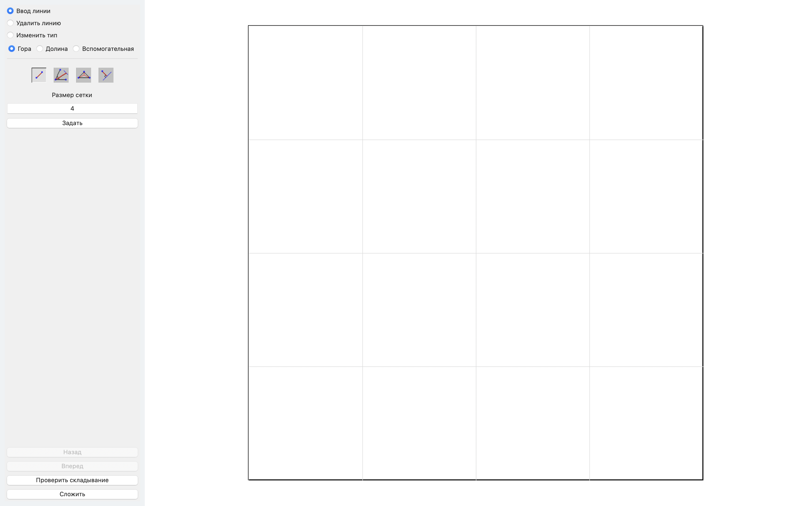
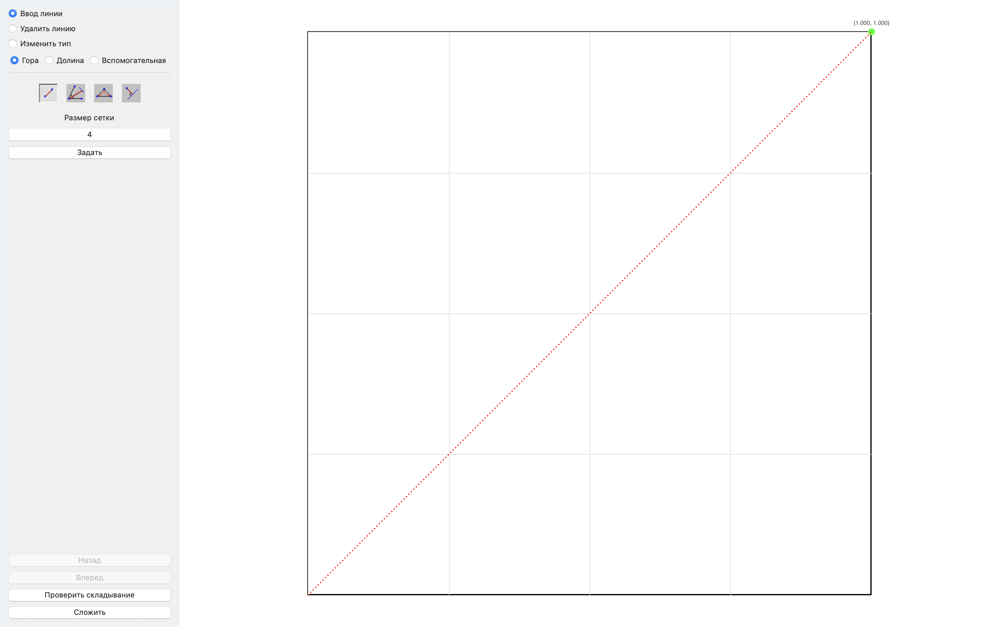
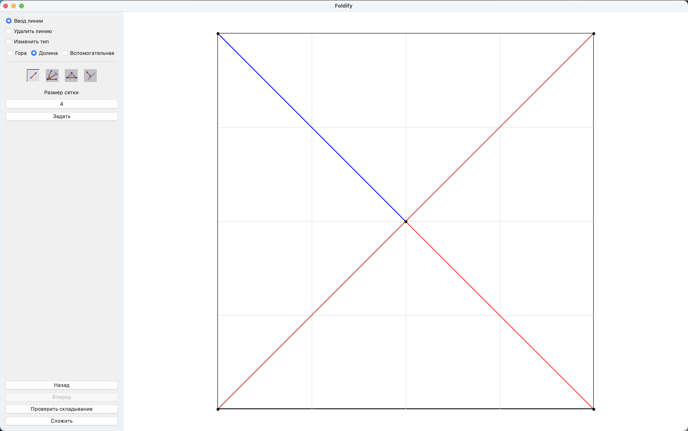
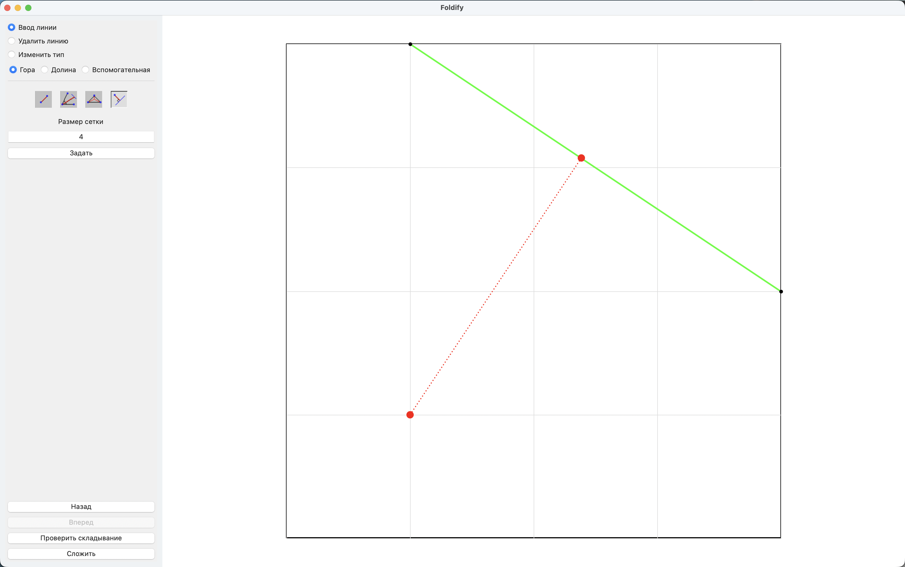
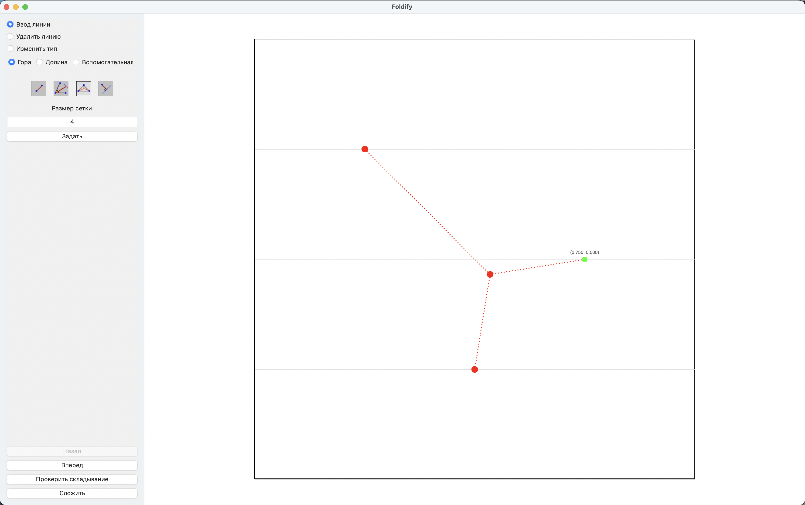
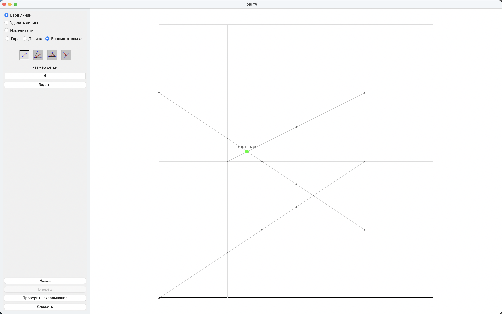

# Foldify - Редактор паттернов складок оригами

## Описание проекта

**Foldify** — это интерактивное графическое приложение для проектирования и анализа паттернов складок оригами (crease patterns). Программа позволяет художникам и исследователям создавать сложные складочные диаграммы с использованием специализированных инструментов геометрического проектирования, проверять корректность паттернов и визуализировать результаты.

Приложение разработано на **wxPython** и предоставляет полнофункциональный интерфейс для работы со складками горного типа (mountain fold), долинного типа (valley fold), вспомогательными линиями и линиями обрезки.

---

## Основной функционал

### Основные возможности

- **Редактирование паттернов складок**
  - Рисование гибких линий складок (горные и долинные складки)
  - Вспомогательные линии для построения
  - Линии обрезки для определения границ готового изделия

- **Геометрические инструменты**
  - Отражение точек и линий
  - Построение перпендикуляров
  - Поиск инцентра треугольника
  - Автоматический поиск пересечений

- **Интеллектуальная сетка**
  - Регулируемая сетка с настраиваемым количеством делений
  - Привязка точек к сетке для точности
  - Относительная и абсолютная система координат

- **Проверка паттернов**
  - Валидация корректности паттерна складок
  - Обнаружение ошибок при складывании
  - Визуализация проблемных областей

- **Сохранение и загрузка**
  - Экспорт паттернов в JSON-формате
  - Восстановление предыдущего состояния

- **Визуализация**
  - Цветовая кодировка типов линий (красный/синий/серый)
  - Отображение координат в реальном времени
  - Просмотр успешно созданных паттернов

---

## Установка

### Требования

- Python 3.8 или выше
- wxPython 4.1+

### Шаги установки

#### 1. Клонирование репозитория

```bash
git clone <repository-url>
cd foldify
```

#### 2. Создание виртуального окружения (рекомендуется)

```bash
python -m venv venv
source venv/bin/activate  # На Windows: venv\Scripts\activate
```

#### 3. Установка зависимостей

```bash
pip install wxPython
```

#### 4. Запуск приложения

```bash
python foldify.py
```

---

## Основные сценарии использования

### Сценарий 1: Создание простого паттерна складок

#### Шаг 1: Запуск приложения

При запуске приложения отобразится главное окно с белым полотном и сеткой.


*Главное окно приложения с пустым полотном и управляющей панелью*

#### Шаг 2: Установка режима рисования

В левой панели выберите тип складки:
- **Mountain Fold** (Горная складка) - для гор, будет красного цвета
- **Valley Fold** (Долинная складка) - для долин, будет синего цвета
- **Auxiliary Line** (Вспомогательная линия) - для построения, серого цвета

```python
# Пример программного обращения:
app = wx.App()
frame = Foldify(None, "Foldify")
# Приложение будет ждать пользовательского ввода
app.MainLoop()
```

#### Шаг 3: Рисование первой линии

1. Кликните в область полотна, чтобы установить первую точку
2. Наведите мышь на нужное место для второй точки
3. Кликните для завершения линии


*Процесс рисования линии с предпросмотром (пунктирная линия)*

#### Шаг 4: Продолжение работы

Повторяйте шаги 2-3 для создания сложного паттерна:

```
Пример простого паттерна:
1. Горная складка (0, 0) → (1, 1)
2. Долинная складка (0, 1) → (1, 0)
3. Вспомогательная линия для построения
```


*Завершённый простой паттерн складок с тремя линиями*

---

### Сценарий 2: Использование геометрических инструментов

#### Инструмент 1: Отражение точки

Отражает выбранную точку относительно линии:

1. Переключитесь в режим **Reflection** (Отражение)
2. Выберите точку для отражения (она подсветится)
3. Выберите линию, относительно которой отражать


*Использование инструмента отражения для создания симметричного паттерна*

```python
# Соответствующая функция в коде:
def reflect_point_over_line(p, a, b):
    """
    Отразить точку p относительно линии (a, b)
    
    Args:
        p: Точка (x, y)
        a: Начало линии (x, y)
        b: Конец линии (x, y)
    
    Returns:
        tuple: Отражённые координаты (x, y)
    """
```

#### Инструмент 2: Перпендикуляр

Строит перпендикуляр из точки на линию:

1. Переключитесь в режим **Perpendicular** (Перпендикуляр)
2. Кликните на исходную точку
3. Выберите линию, к которой нужен перпендикуляр
4. Система автоматически найдёт точку пересечения перпендикуляра с линией


*Построение перпендикуляра из точки на линию*

```python
# Функция поиска перпендикуляра:
def point_to_line_distance(p, a, b):
    """
    Вычислить минимальное расстояние от точки до отрезка
    и найти точку пересечения перпендикуляра
    """
```

#### Инструмент 3: Инцентр треугольника

Находит центр вписанной окружности для трёх выбранных точек:

1. Переключитесь в режим **Incenter** (Инцентр)
2. Выберите три вершины треугольника
3. Система найдёт инцентр и покажет его центром и линиями к вершинам


*Нахождение инцентра треугольника с визуализацией вписанной окружности*

```python
def triangle_incenter(a, b, c):
    """
    Вычислить инцентр (центр вписанной окружности) треугольника
    
    Формула:
        I = (a*|BC| + b*|CA| + c*|AB|) / (|AB| + |BC| + |CA|)
    где |BC|, |CA|, |AB| - длины сторон
    """
```

---

### Сценарий 3: Настройка сетки

Сетка помогает позиционировать точки с высокой точностью:

#### Изменение количества делений

1. Найдите поле **Division** (Деления) в правой панели
2. Введите число от 1 до 100 (количество делений на одной стороне квадрата)
3. Сетка пересчитается автоматически


*Панель настройки сетки с различными уровнями детализации*

```python
# Пример использования:
# Деления = 4: квадрат разделён на 4×4 = 16 ячеек
# Деления = 8: квадрат разделён на 8×8 = 64 ячейки
# Деления = 16: для высокоточного проектирования
```

#### Относительные координаты

При наведении мыши на полотно отображаются координаты в диапазоне **(0.0, 0.0)** до **(1.0, 1.0)**:


*Отображение координат под курсором мыши в формате (x, y)*

---

### Сценарий 4: Сохранение и загрузка паттерна

#### Сохранение паттерна

1. Нажмите **File** → **Save** в меню приложения
2. Выберите место для сохранения
3. Файл будет сохранён в JSON-формате

```python
# Структура сохраняемого JSON-файла:
{
  "lines": [
    {
      "p0": {"x": 0.0, "y": 0.0},
      "p1": {"x": 1.0, "y": 1.0},
      "type": 1  # 1=MOUNTAIN, 2=VALLEY, 3=AUX, 4=CUT
    }
  ],
  "vertices": [
    {"p": {"x": 0.0, "y": 0.0}}
  ]
}
```

#### Загрузка паттерна

1. Нажмите **File** → **Open** в меню приложения
2. Выберите JSON-файл с сохранённым паттерном
3. Паттерн загрузится в редактор


*Диалог сохранения паттерна в JSON-формате*

---

### Сценарий 5: Проверка корректности паттерна

После создания паттерна можно проверить его корректность:

1. Нажмите **Tools** → **Validate Pattern** (Проверить паттерн)
2. Система проанализирует паттерн на ошибки
3. Если ошибок нет, откроется окно с визуализацией успешного паттерна


*Окно успешной проверки паттерна с визуализацией всех складок*

---

## Справка по типам линий

| Тип | Цвет | Обозначение | Использование |
|-----|------|-------------|---------------|
| **Mountain Fold** | Красный | — | Горный сгиб (видимый снизу) |
| **Valley Fold** | Синий | ~ | Долинный сгиб (видимый сверху) |
| **Auxiliary Line** | Серый | .. | Вспомогательная линия для построения |
| **Cut Line** | Чёрный | — | Линия обрезки |

---

## Архитектура программы (для программистов)

### Основные классы

#### 1. `Point2D` - Двумерная точка

```python
@dataclass(frozen=True, eq=True)
class Point2D:
    """Двумерная точка с поддержкой векторных операций"""
    x: float
    y: float
    
    def __add__(self, other: "Point2D") -> "Point2D":
        """Сложение векторов"""
    
    def distance_to(self, other: "Point2D") -> float:
        """Расстояние до другой точки"""
    
    def normalized(self) -> "Point2D":
        """Нормализованный вектор"""
```

#### 2. `Line` - Линия складки

```python
@dataclass
class Line:
    """Представляет линию складки в паттерне"""
    p0: Point2D  # Начало линии
    p1: Point2D  # Конец линии
    type: LineType  # MOUNTAIN, VALLEY, AUX, CUT
    
    def midpoint(self) -> Point2D:
        """Середина линии"""
    
    def length(self) -> float:
        """Длина линии"""
```

#### 3. `CreasePattern` - Паттерн складок

```python
class CreasePattern:
    """Основной класс, представляющий паттерн складок"""
    
    def __init__(self):
        self.lines: List[Line] = []
        self.vertices: List[Vertex] = []
    
    def add_line(self, p0: Point2D, p1: Point2D, type: LineType) -> bool:
        """Добавить линию в паттерн"""
    
    def validate(self) -> bool:
        """Проверить корректность паттерна"""
    
    def get_intersections(self) -> List[Point2D]:
        """Найти все пересечения линий"""
```

#### 4. `Foldify` - Главное окно приложения

```python
class Foldify(wx.Frame):
    """Главное окно графического редактора"""
    
    def __init__(self, parent, title):
        super().__init__(parent, title=title, size=(1400, 900))
        
    def on_paint(self, event):
        """Обработчик события рисования"""
    
    def on_mouse_motion(self, event):
        """Обработчик движения мыши"""
    
    def on_mouse_left_down(self, event):
        """Обработчик клика левой кнопкой"""
```

### Ключевые функции обработки геометрии

```python
# Поиск пересечения двух линий
def line_intersection_rel(line1, line2) -> Optional[Tuple[float, float]]:
    """Найти пересечение двух отрезков прямых"""

# Расстояние от точки до линии
def point_to_line_distance(p, a, b) -> float:
    """Вычислить минимальное расстояние"""

# Отражение точки относительно линии
def reflect_point_over_line(p, a, b) -> Tuple[float, float]:
    """Отразить точку p относительно линии (a, b)"""

# Инцентр треугольника
def triangle_incenter(a, b, c) -> Tuple[float, float]:
    """Найти центр вписанной окружности"""
```

### Система координат

Программа использует две системы координат:

1. **Относительные координаты (0.0 - 1.0)**
   - Независимы от размера окна
   - Используются для сохранения данных
   - Диапазон: (0, 0) - нижний левый, (1, 1) - верхний правый

2. **Абсолютные координаты (экранные пиксели)**
   - Зависят от размера окна
   - Используются для отрисовки
   - Преобразование: `abs = rel * scale + offset`

```python
def rel_to_abs(self, rel_point: Tuple[float, float]) -> Optional[Tuple[float, float]]:
    """Преобразовать из относительных в абсолютные координаты"""

def abs_to_rel(self, abs_point: Tuple[float, float]) -> Optional[Tuple[float, float]]:
    """Преобразовать из абсолютных в относительные координаты"""
```

### Режимы работы

Приложение поддерживает несколько режимов:

```python
MODE_INPUT = 0      # Режим рисования линий
MODE_EDIT = 1       # Режим редактирования
MODE_VIEW = 2       # Режим просмотра

SUBMODE_SEGMENT = 0     # Рисование отрезков
SUBMODE_REFLECT = 1     # Отражение
SUBMODE_INCENTER = 2    # Инцентр треугольника
SUBMODE_PERP = 3        # Перпендикуляр
```

### Типы линий

```python
class LineType(Enum):
    MOUNTAIN = 1  # Горная складка (красная)
    VALLEY = 2    # Долинная складка (синяя)
    AUX = 3       # Вспомогательная линия (серая)
    CUT = 4       # Линия обрезки
    NONE = 0      # Отсутствие типа
```

---

## Примеры кода для разработчиков

### Пример 1: Создание паттерна программно

```python
from foldify import CreasePattern, Point2D, LineType

# Создать паттерн
pattern = CreasePattern()

# Добавить горную складку
p0 = Point2D(0.0, 0.0)
p1 = Point2D(1.0, 1.0)
pattern.add_line(p0, p1, LineType.MOUNTAIN)

# Добавить долинную складку
p2 = Point2D(0.0, 1.0)
p3 = Point2D(1.0, 0.0)
pattern.add_line(p2, p3, LineType.VALLEY)

# Проверить корректность
if pattern.validate():
    print("Паттерн валидный!")
```

### Пример 2: Работа с геометрией

```python
from foldify import (
    reflect_point_over_line,
    triangle_incenter,
    line_intersection_rel
)

# Отражение точки
point = (0.5, 0.5)
line_start = (0.0, 0.0)
line_end = (1.0, 1.0)
reflected = reflect_point_over_line(point, line_start, line_end)
print(f"Отражённая точка: {reflected}")

# Поиск инцентра треугольника
a = (0.0, 0.0)
b = (1.0, 0.0)
c = (0.5, 1.0)
center = triangle_incenter(a, b, c)
print(f"Инцентр: {center}")

# Пересечение двух линий
line1 = ((0.0, 0.0), (1.0, 1.0))
line2 = ((0.0, 1.0), (1.0, 0.0))
intersection = line_intersection_rel(line1, line2)
print(f"Пересечение: {intersection}")
```

### Пример 3: Расширение приложения

Для добавления нового инструмента геометрии:

```python
class Foldify(wx.Frame):
    # Добавить новый SUBMODE
    SUBMODE_CUSTOM = 4
    
    def on_custom_tool(self):
        """Обработчик нового инструмента"""
        self.submode = self.SUBMODE_CUSTOM
    
    def on_mouse_left_down(self, event):
        # В существующем обработчике добавить:
        if self.submode == self.SUBMODE_CUSTOM:
            # Ваша логика здесь
            pass
```

---

## Горячие клавиши

| Клавиша | Действие |
|---------|----------|
| `M` | Переключить на Mountain Fold |
| `V` | Переключить на Valley Fold |
| `A` | Переключить на Auxiliary Line |
| `C` | Переключить на Cut Line |
| `Delete` | Удалить выбранную линию |
| `Ctrl+S` | Сохранить паттерн |
| `Ctrl+O` | Открыть паттерн |
| `Ctrl+Z` | Отменить последнее действие |
| `Escape` | Отмена текущего действия |

---

## Известные ограничения и особенности

1. **Точность**: Использует float64, рекомендуется для паттернов с делениями до 64
2. **Производительность**: При более чем 1000 линий может замедлиться отрисовка
3. **Сохранение**: Формат JSON, совместим с большинством инструментов обработки данных
4. **Валидация**: Проверяет геометрическую корректность, но не физическую складываемость

---

## Часто задаваемые вопросы (FAQ)

**Q: Как начать новый паттерн?**
A: Нажмите `File` → `New` или используйте `Ctrl+N` для начала с чистого листа.

**Q: Могу ли я редактировать точки после рисования линии?**
A: Да, переключитесь в режим `Edit` и кликните на точку для изменения её позиции.

**Q: Какой формат используется для сохранения?**
A: JSON-формат для максимальной совместимости и читаемости.

**Q: Как экспортировать паттерн в другие форматы?**
A: Используйте JSON-файл как промежуточный формат для конвертации.

**Q: Есть ли предел на количество линий?**
A: Нет технического предела, но производительность может зависеть от системы.

---

## Лицензия

Данный проект распределяется под лицензией MIT.

---

## Контакты и поддержка

Для вопросов, багов и предложений:
- Создайте Issue на GitHub
- Отправьте Pull Request с исправлениями
- Свяжитесь через форму обратной связи проекта

---

## История версий

### v1.0.0 (Текущая версия)
- ✅ Полнофункциональный редактор паттернов складок
- ✅ Поддержка четырёх типов линий
- ✅ Геометрические инструменты (отражение, перпендикуляры, инцентры)
- ✅ Сетка и привязка к сетке
- ✅ Сохранение и загрузка в JSON
- ✅ Валидация паттернов
- ✅ Интуитивный GUI на wxPython

---

**Спасибо за использование Foldify!** 🎨
